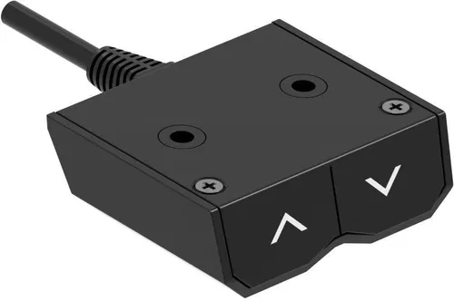
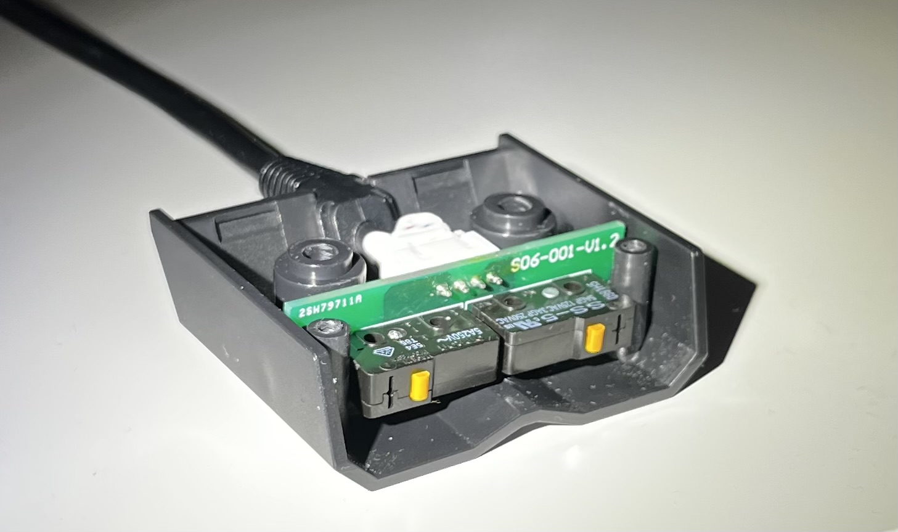
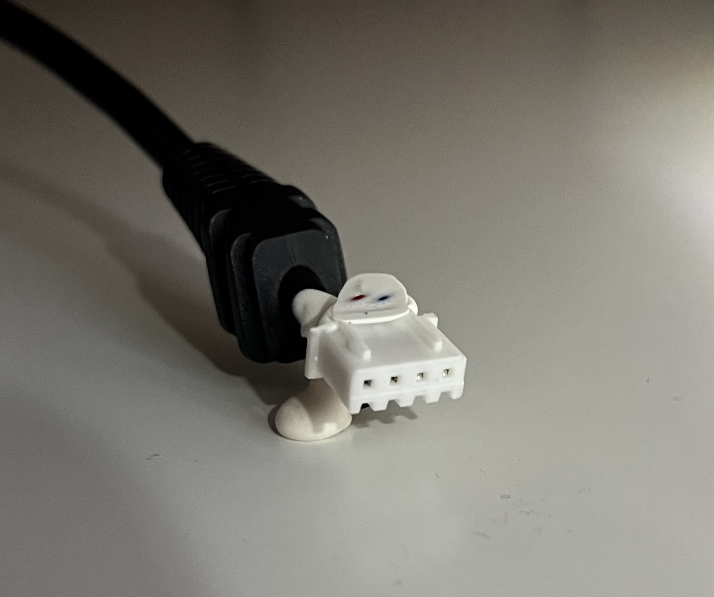

# Smartify your AlzaErgo T2.1 Table with ESP

> [!NOTE]
> This repo and this project is just a documentation and a sort of step by step guide of my work that I thought I would share.

> [!WARNING]
> This table uses fairly high voltage at the switches (30V~4A) so make sure it isn't plugged in when doing any kind of work on it. Also be aware that this could void your warranty.

In this project I wanted to "smartify" the existing controller of the table. By default it comes with a very simple 2 button controller, each button moving the table up or down respectively. There were no memory functions or predefined heights, so I had to hold the up button until I was satisfied with the height of the tabletop.

#### There were a few problems with this:
 - I always had to eyeball the desired height when I wanted to stand up.
 - I had to be standing next to the table until it reached the height I wanted it to.
 - I easily forgot that it was an adjustable desk so I used the function less and less as time went by.

The solution was simple: **make it smart**. By doing so, with a single button press the table could move to a predefined height that was perfect for *my* height every time. I also could grab a cup of coffee while the desk was moving.
And by adding the microcontroller to my smart home system, I could set up notifications if I've been sitting at the table for too long without standing up, or even automating the standign up process to force me to stand up a little every few hours.

## The factory controller

So the first task was to disassemble the controller the table came with, to identify the components, measure voltages and plan out what components I would need to smartify things.

After unscrewing the the philips screws visible in theis picture, we get to see the mini PCB and the two buttons:

The connector had a little glue on it, but mine came off easily. After the lid had been taken off, the whole PCB slid right out.

The connector is just a standart 4-pin one.

## The PCB

At first look it seems simple enough. It has a [4 pin JST connector](https://en.wikipedia.org/wiki/JST_connector) and 2 [OMRON SS5](https://omronfs.omron.com/en_US/ecb/products/pdf/en-ss.pdf) buttons.

All I had to figure out was the wirings between the 4 pins of the connector and the 6 pins of the buttons.
Sadly I couldn't see much of the PCB traces, since the components block most if it, but with a multimeter I tested every connection between every 2 points, with every button state possible. Here's what I found:

> [!IMPORTANT]
> Im not an electrical engineer, so don't judge me too hard for these drawings, I just wanted to understand the logic of the compontents.

| What I could see from the traces |
| --- |
| poiasaod |